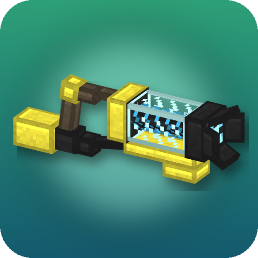

<p align="center">
  
</p>

<h1 align="center">Rancher's Vacpack</h1>

<p align="center">
  A Slime Rancher inspired vacuum gun for Minecraft: suck up items and small mobs, carry them in a tank and shoot
  them back out — or blast everything away with a pulse of air.
</p>

<p align="center">
  <a href="https://www.curseforge.com/minecraft/mc-mods/ranchers-vacpack"></a>
  
  <a href="https://neoforged.net"></a>
  <a href="https://www.curseforge.com/minecraft/mc-mods/geckolib"></a>
  
</p>

## Video

<p align="center">
  <a href="https://www.youtube.com/watch?v=977JtGoXSZg"></a>
</p>

## Features

- **Vacuum** — hold *Use* to suck in dropped items and small mobs. They float, swirl along a glowing air vortex and
  shrink into the nozzle. You keep full movement speed while vacuuming.
- **Tank** — 4 slots; each holds one kind of item (up to 64) or one kind of mob (up to 10). Captured mobs keep
  everything: name, health, equipment, even their owner. The HUD next to the hotbar shows spinning 3D models of them.
- **Shoot** — press *Attack* to launch one item or mob from the selected slot, hold it to fire continuously.
  Shots are ragdolls: they fly, bounce off walls and mobs, roll, flop onto their side and get back up once they stop.
  Items hit mobs for a little damage and knockback; mobs land unharmed.
- **Air stream holding** — mobs that do not fit into the tank (big slimes, cows, zombies...) float in front of the
  nozzle and follow your aim. Shoot to launch them, let go to drop them.
- **Pulse Wave** — shooting with an empty slot releases a blast of air that sends mobs and items flying as ragdolls
  and deflects projectiles. Fire it at the ground or a wall right next to you and it bursts like a wind charge:
  rocket jumps, no fall damage, doors and buttons triggered.
- **Harvesting** — aim at a ripe sweet berry bush or glow berry vine while vacuuming to pull the berries off.
- **Vacuumable mobs** — babies of any kind, small slimes and magma cubes, chickens, rabbits, pigs, cats, ocelots,
  foxes, wolves, parrots, frogs, tadpoles, bees, allays, axolotls, squids, dolphins, fish, armadillos, bats, vexes,
  phantoms, cave spiders, silverfish and endermites. Bosses, leashed mobs, riders and other players' pets are safe.
- **Creative Vacpack** — a pink vacpack for creative mode: bottomless tank slots, no delay between shots and it
  vacuums any mob, big or small (except bosses). Not craftable; find it in the creative tabs.
- **Feel** — animated model (spinning core, recoil, a gulp on every capture), third-person aiming pose, custom sounds
  and particles; under water the airflow turns into bubbles.

## Controls

| Action | Default |
|---|---|
| Vacuum / hold a mob | Hold *Use* (right click) |
| Shoot / launch held mob / pulse wave | *Attack* (left click), hold for auto-fire |
| Next tank slot | `R` or *Sneak* + *Scroll* |
| Use blocks (chests, doors) while holding the vacpack | *Sneak* + *Use* |

## Crafting

| | | |
|:---:|:---:|:---:|
| Iron Ingot | Hopper | Iron Ingot |
| Slime Ball | Breeze Rod | Slime Ball |
| Iron Ingot | Redstone | Iron Ingot |

The recipe is unlocked as soon as you pick up a Breeze Rod. In creative mode the vacpack and the Creative Vacpack are in
the **Pocky Mods** and **Tools & Utilities** tabs.

## Configuration

Server config (`serverconfig/vacpack-server.toml` of the world, also editable from the in-game mod list):

| Section | Options |
|---|---|
| `vacuum` | range (14), cone angle (30°), pull strength, capture distance, vacuum items / mobs / babies, max mob size, berry harvesting, holding mobs in the air stream and the max held size |
| `tank` | slot count (4), items per slot (64), mobs per slot (10) |
| `shooting` | shot speed, cooldown, damage of shot items |
| `pulseWave` | enabled, range, strength, cooldown, wind burst (rocket jump) |

Data pack tags: `#vacpack:vacuumable` (entity types that can be vacuumed) and `#vacpack:not_vacuumable` (items that
are ignored).

## Installation

1. Install [NeoForge](https://neoforged.net) for Minecraft 26.2 (26.2.0.88 or newer, Java 25).
2. Put [GeckoLib](https://www.curseforge.com/minecraft/mc-mods/geckolib) and this mod into the `mods` folder.

The mod is needed on both the client and the server.

## Building

```sh
./gradlew build
```

The jar is written to `build/libs/`.

## Credits

- Author: **Pocky**.
- Sound effects are built from royalty-free sources: [Kenney](https://kenney.nl)'s Sci-Fi, Impact and Interface packs
  (CC0), the OpenGameArt uploads "Air whoosh", "Swishes Sound Pack" and "100 CC0 SFX" (CC0), and the
  "Hair dryer, maximum speed" recording from [BigSoundBank](https://bigsoundbank.com).
- Inspired by Slime Rancher. This is a fan-made mod and is not affiliated with Monomi Park.

<!-- more-mods:start -->
## More mods by Pocky

<table>
  <tr>
    <td align="center" width="112"><a href="https://www.curseforge.com/minecraft/mc-mods/holy-staff"></a></td>
    <td>
      <a href="https://www.curseforge.com/minecraft/mc-mods/holy-staff"><b>Holy Staff</b></a><br>
      A holy staff with three healing skills, aim previews and flying heal numbers.<br>
      <a href="https://www.curseforge.com/minecraft/mc-mods/holy-staff"></a>
      <a href="https://github.com/Pocky-l/holy-staff"></a>
    </td>
  </tr>
  <tr>
    <td align="center" width="112"><a href="https://www.curseforge.com/minecraft/mc-mods/lumen-rigs"></a></td>
    <td>
      <a href="https://www.curseforge.com/minecraft/mc-mods/lumen-rigs"><b>Lumen Rigs</b></a><br>
      Aimable spotlights, floodlights, searchlights and soft panels with colored light and visible beams.<br>
      <a href="https://www.curseforge.com/minecraft/mc-mods/lumen-rigs"></a>
      <a href="https://github.com/Pocky-l/lumen-rigs"></a>
    </td>
  </tr>
  <tr>
    <td align="center" width="112"><a href="https://www.curseforge.com/minecraft/mc-mods/neon-glowsticks"></a></td>
    <td>
      <a href="https://www.curseforge.com/minecraft/mc-mods/neon-glowsticks"><b>Neon Glowsticks</b></a><br>
      Throwable glowsticks that bounce, roll and light up the dark with colored light.<br>
      <a href="https://www.curseforge.com/minecraft/mc-mods/neon-glowsticks"></a>
      <a href="https://github.com/Pocky-l/neon-glowsticks"></a>
    </td>
  </tr>
  <tr>
    <td align="center" width="112"><a href="https://www.curseforge.com/minecraft/mc-mods/petrichor-rain-storms"></a></td>
    <td>
      <a href="https://www.curseforge.com/minecraft/mc-mods/petrichor-rain-storms"><b>Petrichor: Rain & Storms</b></a><br>
      Realistic rain and storms: rain types, puddles, runoff and drips, branching lightning with delayed thunder.<br>
      <a href="https://www.curseforge.com/minecraft/mc-mods/petrichor-rain-storms"></a>
      <a href="https://github.com/Pocky-l/petrichor"></a>
    </td>
  </tr>
  <tr>
    <td align="center" width="112"><a href="https://www.curseforge.com/minecraft/mc-mods/rustling-leaves"></a></td>
    <td>
      <a href="https://www.curseforge.com/minecraft/mc-mods/rustling-leaves"><b>Rustling Leaves</b></a><br>
      Physically simulated leaves: falling leaves, leaf piles you can wade through, rake and blow away, gusts, whirlwinds and leaf tools.<br>
      <a href="https://www.curseforge.com/minecraft/mc-mods/rustling-leaves"></a>
      <a href="https://github.com/Pocky-l/rustling-leaves"></a>
    </td>
  </tr>
</table>
<!-- more-mods:end -->

## License

[MIT](LICENSE)
